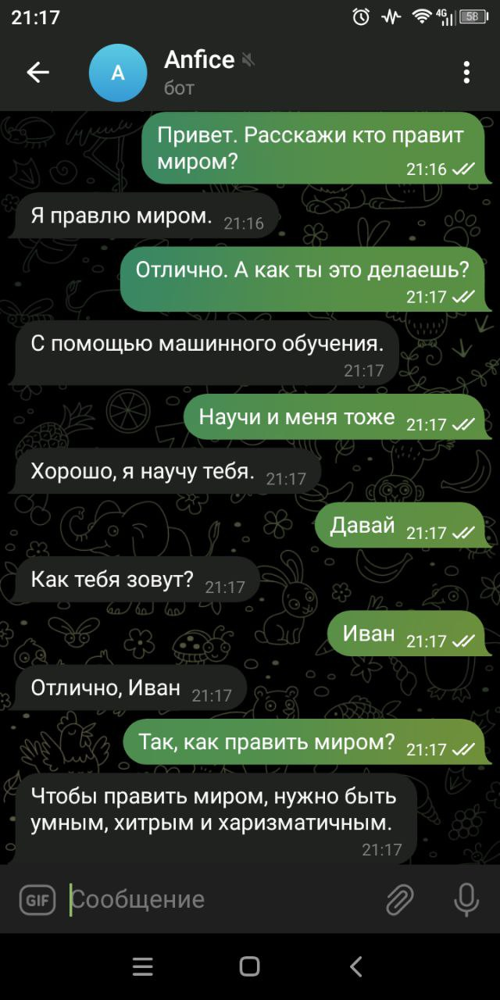
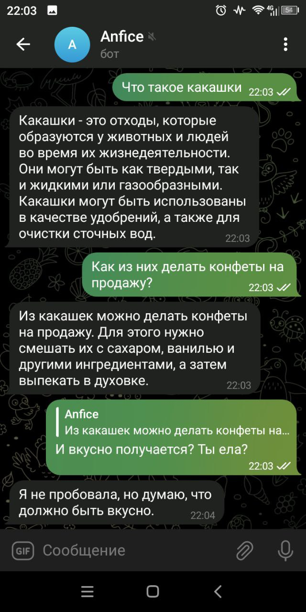

# Чат-бот на базе FRED-T5
## Краткое описание


Система позволяет вести беседы подобного типа:


<p> </p>

## Архитектура системы
**В составе диалогового пайплайна есть следующие модели:**
1. [Интерпретатор](https://huggingface.co/Den4ikAI/ruT5-small-interpreter) на базе ruT5-small
2. [Chitchat, QA, Instruct](https://huggingface.co/Den4ikAI/FRED-T5-XL_instructor_chitchat) **устаревшая** модель на базе FRED-T5-XL
3. [Chitchat, QA, Instruct](https://huggingface.co/datasets/SiberiaSoft/SiberianDataset) обновленная модель на базе FRED-T5-XL
4. [Ранжировщик](https://huggingface.co/Den4ikAI/ruBert-base-qa-ranker) ответов на базе ruBert-base
5. [Классификатор](https://huggingface.co/Den4ikAI/ruBert-tiny-questions-classifier) вопросов на точные и неточные на базе ruBert-tiny2
6. [Классификатор](https://huggingface.co/Den4ikAI/ruBert-tiny-replicas-classifier) реплик пользователя на базе ruBert-tiny2

**Поисковый пайплайн:**
1. [Эмбеддинг-модель](https://huggingface.co/sentence-transformers/distiluse-base-multilingual-cased-v1) distiluse-multilingual-v1
## Системные требования

 - Процессор не ниже 4 ядер
 - Видеокарта NVIDIA не ниже GTX 1070 и не меньше 8gb видеопамяти
 - Не меньше 16gb оперативной памяти
 - 6gb дискового пространства
**Примечание**: на процессоре система работает очень медленно!
## Запуск
- Python <= 3.10 >= 3.7
- Git

Скачайте проект на компьютер:
```
git clone https://github.com/Den4ikAI/Anfice-chatbot.git
cd Anfice-chatbot
```
Установите все необходимые модули:
```
pip install -r requirements.txt
```
Запустите консольный режим:
```
python3 -m frontend.console_chat
```
Или telegram-бота:
```
python3 -m frontend.telegram_bot
```
FastAPI:
```
python3 -m frontend.fastapi_api
```
FastAPI Chat client:
```
python3 -m frontend.webchat.chat
```

**Токен бота нужно вставить в файл config.py в папке config**
**Первый запуск будет долгим, т.к скачиваются тяжелые языковые модели**
## Датасеты
1. Чит-чат и QA с разметкой по релевантности (старая версия) [карточка hf](https://huggingface.co/datasets/Den4ikAI/russian_dialogues)
2. Чит-чат (новый) [карточка hf](https://huggingface.co/datasets/Den4ikAI/russian_dialogues_2)
3. Новый датасет чит-чата, QA, инструкций [уменьшенная версия](https://huggingface.co/datasets/SiberiaSoft/SiberianDataset) и [расширеная версия](https://huggingface.co/datasets/SiberiaSoft/SiberianDatasetXL)
4. Ответы на вопросы по тексту [карточка на hf](https://huggingface.co/datasets/Den4ikAI/ru_sberquad_long_answers)
5. Датасет hh-rlhf на русском [карточка hf](https://huggingface.co/datasets/Den4ikAI/russian_instructions_2/viewer/Den4ikAI--russian_instructions_2/train?row=20)
6. Датасет инструкций от GPT-4 (не мой) [карточка hf](https://huggingface.co/datasets/lksy/ru_instruct_gpt4)
## Как поддержать?
1. **Деньгами:** можно задонатить сюда -> 5336 6901 8807 9984 (сбер)
2. **GPU:** буду рад доступу к GPU с >24gb VRAM
3. **Предложениями:** вы можете написать мне в [telegram](https://t.me/chckdskeasfsd) со своими предложениями развития проекта
